# Diagrama de la Solución

```mermaid
graph TD
    A[App.jsx] --> B[Layout.jsx]
    B --> C[Navigation.jsx]
    B --> D[LanguageSelector.jsx]
    
    %% Páginas Principales
    A --> E[Home.jsx]
    A --> F[Calendar.jsx]
    A --> G[ProfessionalLife.jsx]
    A --> H[NextChallenges.jsx]
    A --> I[SupporterZone.jsx]
    A --> J[NotFound.jsx]
    
    %% Componentes de Home
    E --> K[CarouselHero.jsx]
    E --> L[MapSection.jsx]
    E --> M[StravaActivities.jsx]
    E --> N[SupporterCarousel.jsx]
    E --> O[VisitCounter.jsx]
    
    %% Categorías de Carreras
    H --> P[Marathons.jsx]
    H --> Q[Ultramarathons.jsx]
    H --> R[StagedUltramarathons.jsx]
    H --> S[Triathlons.jsx]
    H --> T[FutureProjects.jsx]
    H --> U[Statistics.jsx]
    
    %% Servicios y Utilidades
    V[Utils] --> W[stravaService.js]
    V --> X[weatherService.js]
    V --> Y[constants.js]
    
    %% Datos
    Z[Data] --> AA[race-events.json]
    Z --> AB[training-events.json]
    Z --> AC[rest-events.json]
    Z --> AD[travel-events.json]
    Z --> AE[professional-projects.json]
    Z --> AF[runningStats.json]
    
    %% Traducciones
    AG[Translations] --> AH[es.js]
    AG --> AI[en.js]
    AG --> AJ[LanguageContext.jsx]
    
    %% Integración de Servicios
    M --> W
    F --> X
    I --> K
```

## Descripción de Componentes

### Componentes Principales
- **App.jsx**: Componente raíz de la aplicación
- **Layout.jsx**: Estructura base de la aplicación
- **Navigation.jsx**: Barra de navegación
- **LanguageSelector.jsx**: Selector de idioma

### Páginas
- **Home.jsx**: Página principal
- **Calendar.jsx**: Calendario de eventos y carreras
- **ProfessionalLife.jsx**: Información profesional
- **NextChallenges.jsx**: Próximos retos y carreras
- **SupporterZone.jsx**: Zona de patrocinadores
- **NotFound.jsx**: Página 404

### Componentes de Home
- **CarouselHero.jsx**: Carrusel principal
- **MapSection.jsx**: Sección de mapa
- **StravaActivities.jsx**: Integración con Strava
- **SupporterCarousel.jsx**: Carrusel de patrocinadores
- **VisitCounter.jsx**: Contador de visitas

### Categorías de Carreras
- **Marathons.jsx**: Maratones
- **Ultramarathons.jsx**: Ultramaratones
- **StagedUltramarathons.jsx**: Ultramaratones por etapas
- **Triathlons.jsx**: Triatlones
- **FutureProjects.jsx**: Proyectos futuros
- **Statistics.jsx**: Estadísticas

### Servicios y Utilidades
- **stravaService.js**: Servicio de integración con Strava
- **weatherService.js**: Servicio de pronóstico del tiempo
- **constants.js**: Constantes de la aplicación

### Datos
Los datos de la aplicación se almacenan en archivos JSON:
- race-events.json
- training-events.json
- rest-events.json
- travel-events.json
- professional-projects.json
- runningStats.json

### Traducciones
La aplicación es bilingüe y utiliza:
- es.js: Traducciones al español
- en.js: Traducciones al inglés
- LanguageContext.jsx: Contexto para gestionar el idioma
